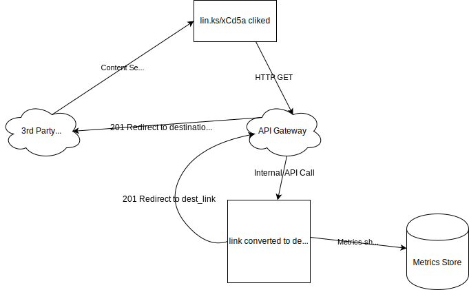

# Project Plan: Link Service
###### Create unique, shortened links to any site.

# Purpose
This document serves to provide an estimation of the requirements, architecture, tools and methodologies used, and plan to create and ship a production-scale link shortening API, which includes a redirection service to route links coming into our domain to their appropriate end URL. 

# Requirements
The requirements, both given by our stakeholders and expanded upon to meet any implicit needs, are as follows:

1. Signup or API Token Service
1. Shortening API
1. Redirect Service
1. Monitoring and Metrics Service

## Signup or API Token Service
Signup should be a self-service solution, where users can post email and password and retrieve a token.

### Route
`/signup`
  * JSON body
    ```
    {
        "email": "validemail@validdomain",
        "password": "strong_password_of_course",
    }
    ```
  * Response
    * HTTP Status: `200 OK`
    * JSON Body
    ```
    {
        "API_KEY": "3a4e6ba6-d542-454a-859e-7f93c5a176c5"
    }
    ```

This API key will be used in the Header of any request, embedded as `X-API-KEY`. This will serve as authentication.

## Shortening API
There will be a REST API that will shorten links and provide access to modify those as needed.

1. Unique links will be provided to each user. 
1. If a user attempts to generate links more than once for a given URL, provide the same link twice. 
1. If two distinct users, A and B, attempt to generate a link to the same destination site, such as https://google.com, they will each be given unique links. 

### Route and Methods
All routes will **require** the header `X-API-KEY`, which is provided by the signup service and serves to identify each user.

Base Route: `/v1/links`

1. `POST`: create unique shortened links
  * JSON Body
  ```
  {
      "destinationLink": "https://validsite.com"
  }
  ```
  * Query Parameters
    * `/v1/links/:link_id?destinationLink="https://validSite.com"`
  * Response
  
    * HTTP_STATUS: `200 OK`
    * JSON Body:
    ```
    {
        "linkId": "link_id",
        "destinationLink": "providedDestinationLink",
        "shortLink": "lin.ks/xCd5a"
    }
    ```

2. `GET`: Retrieves one or all of a customers generated links
  * Query Parameters
    * `/v1/links/` --> Returns all
    * `/v1/links/:link_id` --> Returns one matching `link_id` if exists
  * Response
    * HTTP_STATUS: `200 OK`
    * JSON Body:
    ```
    {
        "shortLinks": [
            {
                "linkId": "link_id",
                "destinationLink": "providedDestinationLink",
                "shortLink": "lin.ks/xCd5b"
            },
            ... // if more than one
        ]
    }
    ```

3. `PUT`: Updates the link associated with the ID
  * JSON Body
  ```
  {
      "destinationLink": "link_to_update.com"
  }
  ```
  * Query Parameters:
    * `/v1/links/:link_id?destinationLink="validsite.com"`
  * Response
    * HTTP_STATUS: `200 OK`
    * JSON Body
    ```
    {
        "linkId": "link_id",
        "destinationLink": "udpatedDestinationLink",
        "shortLink": "lin.ks/<updatedLink>" // explanation on why this _should_ be a new link later
    }
    ```

4. `DELETE`: Removes link matching `link_id`
  * Query Parameters: 
    * `/v1/links/:link_id`
  * Response
    * HTTP_STATUS: `204 No Content`

## Redirect Service
The redirect service will receive inbound requests with the given route format of `/:link_id`. Note, this is not via the `/v1/links` route. It is is the base route, and thus how the distinction is made. Inbound requests to this route will provide the `link_id`, which is the base62 format that can be converted to base10, and therefore provide the original link, uniquely, every time. 

Below is a Diagram depicting this flow from when the end user clicks a link.



## Monitoring and Metrics Service
Per the stakehold requirements the service should log metrics given the total and per-link usage.

1. Total number of clicks
1. Number of clicks by day
1. Total number of people who clicked links
1. Total number of people who clicked by day

These metrics will be shipped to the chosen metrics store at the API Gateway level, or in the request handling as needed. At the time of implementation this decision can be made. The most likely case is that when the request is handled by the Request service, these metrics can be placed into some store, perhaps a time-series store, and a monitoring and metrics solution can be used to aggregrate and report on this data. There will be more on this later in the tools section.

# Architecture
Given that time to production is a key concern with this project, we will be using [Serverless](https://aws.amazon.com/serverless/) architecture through AWS. This solution was chosen as it is proven, well-documented, and reduces the overhead associated with developing, maintaining, and scaling infrasture ourselves. 

Simply put the architecture will consist of several elements, working in tandem to receive, process, store, monitor, and respond to incoming requests at scale, in which costs are only incurred as resources are used. These architectural components are as follows:

1. [API Gateway](https://aws.amazon.com/api-gateway/)
1. [AWS Lambdas](https://aws.amazon.com/lambda/)
1. [Amazon Aurora Serverless](https://aws.amazon.com/rds/aurora/serverless/)
1. [AWS CloudWatch](https://aws.amazon.com/cloudwatch/) with built-in and custom metrics

## API Gateway
* Gateway should be configured to handle only `https` requests.
* Gateway will be configured to route `/v1/links` to the Links API and `/:link_id` to the Redirect Service

## Lambdas
* Links API - This can be configured with one gateway to handle `Any` method. Should be a simple set of a few lambdas
* Encoding Algorithm - after some research, there are [algorithms](https://medium.com/swlh/how-to-build-a-tiny-url-service-that-scales-to-billions-f6fb5ea22e8c) to map base 10 items to base 62 which given a 5 character string can provide upwards of 916 Million concurrent distinct links. If more are needed, another character can be added for exponentially more unique links.
* Redirect Service - This service is essentially an API that integrates with the Encoding Algorithm to decode the unique link and respond to the API Gateway with a 201 Redirect and the location of where. Importantly, all metrics should be taken here, with the exception of potentially click totals, which can be logged at the gateway level; this decision should be made at time of implementation with the best information available.

## Database
The database will be relational. This will facilitate ensuring that a user who attempts to create a shortened link to the same destination will receive the same link as a response. There will be two minimal tables, at least at first. More may be added as needed during development. Those tables are as follows: 

* Users Table: `_id (primary_key), email, password_hash, tokens`
* Links Table: `_id (primary_key), user_id (foreign_key), destination_link, short_link`

There is a possibility that we may need to store our metrics in a timeseries store. AWS offers a solution, [Timestream](https://aws.amazon.com/timestream/), that may fit this need. Otherwise, there may be some implementation work to handle our own. Time will be built into a discovery phase for this portion to accomodate this possibility. 

## CloudWatch
CloudWatch should handle the aggregation of built-in and custom traffic metrics and aggregation. The custom metrics will most likely be the ones we send for per-link metrics. Otherwise, the aggregation logic should be handled within CloudWatch. 

# Technologies & Methodologies
This section provides the list and reasoning of tools and methodologies to be used in this project. 

## Programming Language
JavaScript and NodeJS will be used with this project. This is our team's speciality, and in the event that our team may scale later, this skill is widely available in the applicant pool. Additionally, this is a language supported natively by AWS Lambdas. 

## Respository & CI/CD Pipeline
[Gitlab](https://docs.gitlab.com/) is our chosen cloud code repository. This is a skill our team has and is very versed in. Additionally, Gitlab provides out-of-the-box CI/CD pipelines and processes, as well as, a very quick to implement custom CI/CD process that will implement quickly with our chosen AWS Environment. This will allow us to submit merge requests, review the code, while automated testing and builds run, thereafter automatically building and deploying our code with only simple button presses. This may require a small amount of time to setup; however, the benefits will be seen later, as our process works more smoothly with the ability to track changes and builds more easily. Additionally, Gitlab comes out-of-the box with project management tools, issue tracking and will work with our chosen project methodology.

## Project Methodology
This project will use [Kanban](https://kanbanize.com/kanban-resources/getting-started/what-is-kanban/) to manage and prioritize our tasks. This methodology works well with a small team in which time to complete a task may fluctuate. As sprints seem overly formal for such a small-scale and small-team project, this methodology allows us to pull tasks as we complete tasks, resulting in a constant flow of work. While tasks may be estimated to take X amount of time, if they're finished before, it will leave us more time on other tasks, or in a best-case scenario allow us to ship even faster than predicted. 

## Multiple Environment setup
In order to maintain consistent production uptime and ensure only quality and performant code is released, we will use a simple multiple-environment setup. Feature branches, `develop`, and `master`. Feature branches will branch off of `develop` for new items. Merge requests are reviewed, tested, and built with new code. If all pass, they are merged into Develop where builds are run and deployed to our `develop` environment. Then, `develop` branch is staged as an MR to `master`. Builds and tests are run there as well. If all are passing they are merged, where again, master will build and test, then deploy any new functionality. If hotfixes are needed, those will branch off of `master` and an MR will be staged targeting the `master` branch. After tests and builds and a successful code review, these can be merged into `master`, and then another MR will target develop to keep this up-to-date with `master` and avoid any convoluted merge conflicts. All of this is doable with Lambdas and Gitlab rather simply. 

# Project Plan & Timeline
As mentioned above, using Kanban provides us flexibility with the order and time frame in which tasks may be completed; however, the following is rough outline for the order and completion timelines of the requirements and environmental setup. 

## Week 1 - Initialization
### Tools Setup & Initial Commit - 7.5 Hours (1 Day)
* Setup workstation, install development tools
* Intialize Repository, Initial commit - integrate with Gitlab
* Project Meeting - 30 min
* Simple `gitlab-ci.yml` for CI/CD pipeline configurations

### AWS Lambda Setup - 2 Days
* Manually build simple Lambda
* Add simple DB integration
* Test locally - create build script
* Add Build script to `gitlab-ci.yml` for future deployments

### API Gateway setup - 7.5 Hours (1 Day)
* Configure API gateway to work with simple lambda
* Project Meeting - 30 min
* Build framework for unit and integration testing
* Add unit and integration testing steps to `gitlab-ci.yml`

### Database Setup & Initial `/signup` Implementation - 1 Day
* Develop database schemas for Users
* Develop lambda for `/signup`
* Integrate `/signup` with API Gateway

## Week 2 - Setup for Speed and Scale
### Copy work from last week - setup multiple environments - 7.5 Hours (1 Day)
* Build out development and production environments in AWS
* Project Meeting - 30 min
* Setup `gitlab-ci.yml` to handle automation throughout `dev` and `master` branches

### Begin Building Logic and Features - 2 Days
* Ehance or finalize unit and integrate test frameworks
* Enhance or finalize `/signup`
* Ensure unit and integration tests are written for `/signup`
* Ensure these are consumed properly by Gitlab
* Troubleshoot these tasks as necessary
* Deploy `/signup` in dev and production environments

### Begin Encoding Algorithm Development - 15.5 Hours (2 Days)
* Research base 10 to base 62 conversion algorithms
* Consider unique seeding solution given load balancers and scale - could provide the same seed to two requests happening simultaneously
* Project Meeting - 30 Min
* Implementation
* Unit tests written for encoding algorithm
* deploy to dev and master

## Week 3 - Holiday Week - Begin Links API 
### Setup Links API Lambda and API Gateways - 7.5 Hours (1 Day)
* Develop `links` table in DB
* Develop simple `POST` or `create` function that integrates with `links` table
* Project Meeting
* Ensure that `create` function integrates correctly with Encoding Algorithm

### Holiday! - 2 Days
* Enjoy some rest and relaxation - try not to think too much about APIs and Algorithms that scale!

### Finalize `Create` Routes - 15.5 Hours (2 Days)
* Setup API Gateway integrations for `/v1/links` route - this should allow for little to no configuration for the rest of the routes
* Finalize `create` route
* Project Meeting - 30 min
* Finalize unit tests and integration tests and ensure passing in Gitlab
* Stage and review MRs, deploy create route to production. 

## Week 4 - Link API Finalization & Begin Redirect Service
### Finalize remaining Link API Routes - 15.5 Hours (2 Days)
* Setup and finalize `GET` route
* Finalize Tests for `GET` Route
* Project Meeting - 30 min
* Setup and Finalize `DELETE` Route
* Finalize Tests for `DELETE` Route
* Setup `PUT` Route to create new link
* Setups `PUT` route tests

### Finalize `PUT` Route & Deploy remaining methods - 1 Day
* Finalize `PUT` route and tests
* Review merge request. Ensure builds and tests passing.
* Deploy and confirm Link APIs in develop and production

### Begin Redirect Service Implementation - 15.5 Hours (2 Days)
* Standup lambda for `/{link_id}` API
* Test locally
* Write Unit and Integration tests
* Integrate API Gateway for Redirect Service

## Week 5 - Finalize Redirect Service & Standup CloudWatch integrations
### Setup CloudWatch Integrations - 7.5 Hours (1 Day)
* Research CloudWatch requirements for integrations
* Project Meeting - 30 min
* Implement into Redirect Service
* Test custom metrics from Redirect Service 

### Finalize Redirect Service - 2 Days
* Ensure sending `201 Redirect` Response to API Gateway
* Ensure sending correct custom metrics to CloudWatch
* Finalize integration and unit tests
* Stage MRs, review, and ensure tests and builds - Release to production

### Build in CloudWatch & Confirm Redirects work through API Gateway - 15.5 Hours (2 Days)
* Create Aggregation Reports in CloudWatch
* Project Meeting - 30 min
* May need lambda to handle API Gateway Redirect
* Build logic to handle redirects to destination link
* Stage MRs, confirm tests and builds, release to production

## Week 6  - Production Testing, Load Testing, and hotfixing
### Explore Load test options or build to suit - 15.5 Hours (2 Days)
* Discover load test solution
* Project Meeting - 30 min
* Build out solution 
* Begin load testing

### Observe, document, and hotfix - 2 Days
* Monitor logs, Resource usage (if applicable)
* Ensure no duplicate link instances - may need seeding work
* Confirm metrics tracking correctly - compare to load testing statistics
* Design and build out hotfix issues

### Review Hotfixes & Plan - 7.5 Hours - 1 Day
* Review Hotfixes
* Project Meeting - 30 min
* Plan hotfixes and issues

## Week 7 - Hotfix & Begin Retests
### Hotfixes - 23.5 Hours (3 Days)
* Patch software as needed
* Project Meeting - 30 min
* Release hotfixes after confirmations, reviews, and successful builds and tests

### Load Tests again - 15.5 Hours (2 Days)
* Begin load tests 
* Project Meeting - 30 min
* Monitor Load Tests

## Week 8 - Go live - or Hotfixes as needed
### Go Live
* If succesful tests - go live
* May need rest of week for hot fixes and retest

# Estimated Release Date
  * Start Date: Jan 13th, 2020
  * 8 week timeline
  * Release Date: Friday, March 6th, 2020